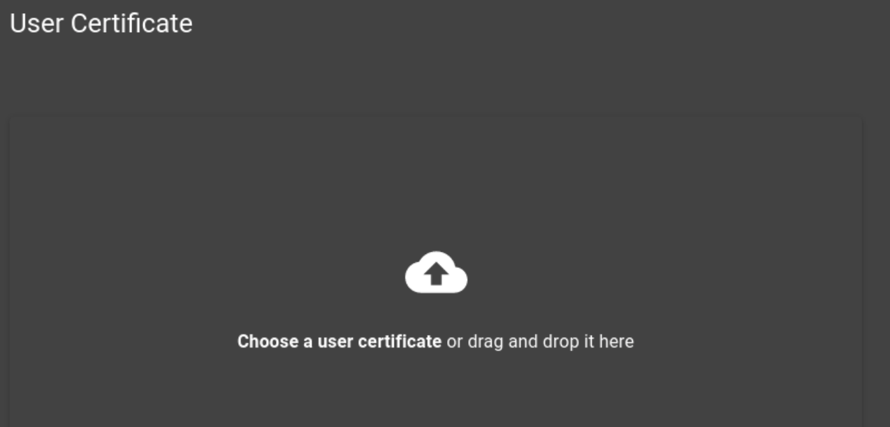

# FLAREclient  UI ***PROTOTYPE*** 

A React/Redux/Material frontend interface for the FLAREclient: A client for TAXII 1.1/2.1 Servers 

## Overview 
This prototype was built extending [ReactCreateApp](https://github.com/facebookincubator/create-react-app). 

*** ADD PROJECT DESCRIPTION HERE (like why this dashboard, high level business logic) ***

## Dev Environment

### Pre-requisites

1. Install [Node.js](https://nodejs.org/en/)


## Docker
The containerization of FLAREclient-UI requires that you have the FLAREclient-Java 
repository locally.
1. Make sure the `FLARECLIENT_JAVA_LOCATION` value is correct in `FLAREclient-UI/build.sh`.
2. Build the docker image `./build-intergrated-image.sh`. This will build the `FLAREclient-Java` `jar` file,
as well as the `FLAREclient-UI` front end.
3. Run the docker image with `./run.sh`.

### Install project dependencies
`$ npm install`
  - this installs the project build tools and dependencies (e.g., webpack, webpack-dev-server, etc.)


### Serve the "development" version of the site locally
create .env file under the top folder and add this:

`REACT_APP_MAIN_URL = 'https://localhost:8443'`

`npm run start`
  - This runs Webpack and Webpack Dev Server, which _builds_ and _serves_ the website locally (i.e., it creates a web server on localhost:3000). If you would like to modify the port, read the ReactCreateApp documentation.

### Build the interface for deployment 

`npm run build`
  - This runs Webpack to build and minify the files specified in the build path found in `scripts/build.js`
  
 The contents of the build directory contain everything you need to render the app in the designated web server. For example to deploy 
 to an NGINX web-server copy the contents of the build directory into the `/site/wwwroot` directory 
  
  

## Unit Testing

While no tests were written due to the lack of time and the limitations of a prototype, the base boilerplate provides 
the ability to run the Jest/Enzyme unit tests:
`npm run tests`. 
To produce code coverage reports: `npm run tests -- --coverage` in which will produce coverage reports within the terminal but also produce 
documents within the **coverage** directory. 


## OCP Environment
If your TAXII server is configured for certificate based authentication, you will have to configure
your client to use the keystore associated with you account.

1. If you have access to the FLAREcloud admin ui, associate your cert with your user. The page in
   the admin ui should look like this:
   
   Once you have associated a user with a certificate, (if the server is configured for certificate
   authentication) all communications received that use your cert will be interpreted as coming
   from your user. **This means if you use your cert with `curl`, `FLAREclient`, or any other means,
   it will be interpreted as coming from your user**.
2. Run your FLAREclient with your cert. For this step, you need a `p12` keystore. We have included
   the script `run-prebuilt.sh` for your convenience. Modify the following line:
   ```aidl
     -v $(pwd)/docker/devKeystore.p12:/opt/app/devKeystore.p12:Z \
   ```
   So that it points to the location of your keystore file. For example, if your keystore is located
   at `/home/someuser/keystore.p12`, then change the line to:
      ```aidl
     -v /home/someuser/keystore.p12:/opt/app/devKeystore.p12:Z \
   ```
   Also make sure to change the values of the following:
   ```aidl
     -e CERT_ALIAS="localhost" \
     -e CERT_KEYSTORE_PASS="12qwaszx@#WESDXC" \
     -e CERT_TRUSTSTORE_PASS="12qwaszx@#WESDXC" \
   ```
   To the correct values for your keystore.

-------